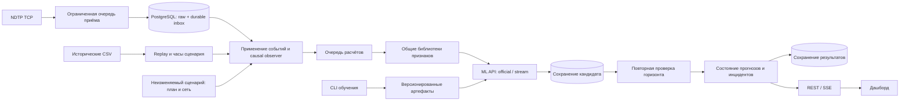

# Архитектура решения

## Компоненты и границы ответственности

Решение состоит из независимо запускаемых Backend, CPU ML API и веб-дашборда.
В Compose используются PostgreSQL, Python/FastAPI и React/TypeScript/Leaflet
за Nginx. SQLite поддерживается для локальной разработки и тестов. Обучение
выполняется отдельными CLI-командами; ML API получает только готовые признаки.

Backend работает одним процессом: он владеет состоянием активного `run_id`,
часами, наблюдаемыми посещениями, очередями и публикацией. Запуск нескольких
независимых workers поверх одной БД не является поддерживаемым способом
масштабирования. Разделение потока между процессами потребует отдельной
координации владения ТС и состояния.

| Область | Реализация и ответственность |
|---|---|
| `backend/ndtp.py` | TCP, handshake, фрейминг, CRC, нормализация пакетов |
| `backend/service.py` | Replay/live, независимые задачи обработки, цели, прогнозы, инциденты, SSE |
| `backend/storage.py` | Транзакции, inbox, сценарии, восстановление, миграции и retention |
| `backend/scenarios.py` | Проверка импортов, перенос времени демо, восстановление схемы сети |
| `predictor/` | Общие признаки, причинный observer посещений и скорости участков |
| `ml/` | Два профиля обучения/инференса, отчёты и официальный submission |
| `frontend/` | Карта всей сети, список ТС, точная карточка инцидента и журнал |

## Конвейер NDTP и сохранность событий

Приём, запись, применение, ML и публикация выполняются отдельными задачами.
Обработка запроса ML не останавливает чтение TCP или обновление снимка.

1. Пакет связывается с ТС через `device_bindings`, проверяется и попадает в
   ограниченную очередь. Суммарный допуск памяти и ожидающего inbox — 5000
   событий. При заполнении приём ждёт; через 10 секунд соединение закрывается
   с требованием переподключения/повтора, счётчик отказов увеличивается.
2. Задача записи объединяет до 500 событий и атомарно сохраняет исходную
   телеметрию и записи inbox. Идентификатор включает `run_id`, ТС и `packet_id`;
   повторная запись не создаёт второе событие. Ошибка БД сохраняет текущий
   пакет в памяти для повторной попытки.
3. Задача применения выбирает готовые записи по
   `max(event_time, received_at) <= время сценария`. Будущий пакет не блокирует
   более поздно поступившие, но уже доступные события. Checkpoint состояния,
   наблюдаемые посещения и отметки обработки inbox фиксируются одной транзакцией.
4. Планировщик собирает расчёты примерно каждые 30 секунд времени сценария,
   отдельно давая шанс впервые появившемуся ТС. В потоке ожидающая задача для
   ТС заменяется более новой; при оценке задания сохраняются по `sample_id`.
5. Признаки рассчитываются вне event loop. ML получает пакеты до 256 запросов
   с таймаутом HTTP. Задача публикации обновляет SSE раз в секунду, а готовый
   прогноз публикуется дополнительно сразу после финальной проверки.

Общий `FeatureBuilder` один раз индексирует историю в массивы NumPy; окна
выбираются бинарным поиском, затем агрегируются без повторных pandas-операций
для каждой точки. Точное совпадение с исходным расчётом проверено на всех
train/test-точках, пропусках, границах окон и разных точностях timestamp.
Оптимизация не меняет признаки, схему или обученные модели.

При применении события Backend один раз создаёт неизменяемую числовую запись
для расчёта признаков, включая отдельно event time и receive time. Она хранится
рядом с исходным событием в том же ограниченном 16-минутном окне и восстанавливается
из raw при рестарте. Задание захватывает только ссылки на такие записи; worker
повторно отсекает оба времени по T и выбирает последние 900 секунд. Индекс плана
переиспользуется в пределах неизменяемого сценария. Это исключает повторное
копирование и разбор всей истории для каждого расчёта без ослабления причинности.

Команды переключения прогонов сериализованы отдельным control lock. Новый
исторический источник сначала загружается и проверяется отдельно от активного
состояния. Ошибочный запрос оставляет текущий NDTP-план, привязки и наблюдения
нетронутыми. Незавершённый checkpoint предыдущего прогона фиксируется до смены;
ожидание БД выполняется вне блокировки состояния и event loop.

Граница долговечности — успешная транзакция raw + inbox. Событие, ещё находящееся
только в памяти при аварийном завершении процесса, требует повторной доставки
источником. TCP-приём сам по себе не означает гарантированный durable commit.
Счётчики admitted, committed, duplicates, rejected и размеры очередей позволяют
проверять эту границу без заявления об exactly-once доставке всего тракта.

## Часы, цель и допустимость публикации

Все API-времена нормализуются в UTC; интерфейс отображает Europe/Moscow.

| Время | Значение |
|---|---|
| `event_time` | Время измерения устройства |
| `received_at` | Когда событие стало доступно приёмнику; в replay берётся из данных |
| Время сценария | В live — текущие UTC-часы; в replay — монотонные часы с множителем 1/5/20, замороженные на паузе |
| `feature_cutoff_at` / `prediction_time` | Срез T, после которого данные не входят в признаки |
| `triggered_at`, `generated_at` | Wall time запуска расчёта и завершения инференса |
| `published_at` | Wall time допуска результата к публикации |
| `published_scenario_at` | Время сценария при том же допуске; по нему проверяется оставшийся горизонт |

Replay продвигает часы по монотонному времени, независимо от длительности ML
и записи БД. Wall time используется для задержек обработки и срока хранения,
поэтому историческая дата не превращает новую запись в просроченную.

Для диспетчера цель — **первое ещё не наблюдённое плановое посещение** в
`(T + 600 с, T + 900 с]`. `target_visit_id` обозначает посещение, а не физическую
остановку. Признаки используют только `event_time <= T` и `received_at <= T`.
Выход `prediction_delay_s` равен «факт минус план»; ожидаемое прибытие — план
плюс подписанный прогноз задержки.

После инференса сначала сохраняется кандидат. Затем, уже после этой записи,
повторно проверяются активный прогон, свежесть телеметрии, отсутствие факта
наблюдения цели, отсутствие более нового результата и оставшийся горизонт.
Только результат с `600 < publication_horizon_s <= 900` становится
`timing_status=verified`. Просроченный первый результат подавляется; другой,
более дальний визит не подставляется в тот же расчёт. Следующий срез выбирает
цель заново. Проверка и помещение результата в SSE не разделены ожиданием I/O.
Финализированная запись сохраняется следом; незавершённый кандидат после
аварии не восстанавливается как подтверждённый текущий прогноз.

Режим `evaluation` использует заданные T, цели и `cur_dev_s`, допускает
телеметрию по `event_time <= T` и маркирует ответы `retrospective`. Он не
создаёт живые инциденты и не доказывает соблюдение горизонта online-публикации.

## Профили ML и проверка качества

| Профиль | Данные признаков | Назначение |
|---|---|---|
| `official` | Официальный срез и предоставленный `cur_dev_s` | Оценка по заданным точкам и submission |
| `stream` | Receive-time cutoff, `cur_dev_s` из общего observer либо missing, качество и скорость участка | Диспетчерский replay и NDTP |

У профилей отдельные артефакты, версии и схемы признаков. `/v1/predict`
проверяет профиль, версию схемы, точный набор полей и уникальность request ID
в пакете. `/v1/profiles` сообщает доступность и версии. CatBoost-регрессор
предсказывает подписанную задержку; отдельно калиброванный классификатор —
вероятность задержки **более 120 секунд**. Stream-профиль обучается на реальных
train-данных с временными разбиениями; test используется для отчётности.

Observer использует только доступную телеметрию и план. Посещение подтверждают
согласованные последовательные координаты около остановки; неоднозначное
сопоставление не превращается в факт. Оценка текущего отклонения имеет срок
свежести 900 секунд. Средняя скорость текущего участка взвешивается по времени
наблюдения; при недостаточном покрытии, коротком интервале или больших разрывах
`segment_speed_kmh=null`, а `speed_coverage` и `quality` объясняют отсутствие.
Эта скорость относится к наблюдаемому текущему участку, который может отличаться
от участка прибытия прогнозируемой цели.

Отчёт stream разделяет `all_points_diagnostic` и `dispatcher_eligible_points`:
общая диагностика включает устаревшие данные и уже наблюдённые цели, а допустимое
подмножество исключает их. Оба результата рассчитаны по заданным test-точкам;
они не заменяют оценку непрерывного NDTP-потока с шагом 30 секунд. MAE сравнивают
с нулём и соответствующим профилю текущим отклонением; вероятность — по Brier
score. Актуальные числа и воспроизводимые команды собраны в
[отчёте проверки](validation.md), артефактах обучения и stream evaluation.

Import и online-план используют разрешённый набор полей. `time_fact_begin`,
`target_delay_s`, `target_class` и labels не поступают в online-признаки.
Исходные CSV не изменяются. Test и validate имеют совпадающую телеметрию;
это не независимые периоды. Фактические прибытия из пересекающихся расписаний
не используются для восстановления validate-ответов. Переносимость на новые
дни остаётся отдельной задачей проверки.

## Риск, свежесть и жизненный цикл инцидента

Риск меняется **сразу по последнему допустимому прогнозу**, без hysteresis:
красный при `p_late >= 0.70`, иначе жёлтый при `p_late >= 0.40` либо
`prediction_delay_s < -60`; зелёный при меньшей известной вероятности;
серый при отсутствии достаточных данных. Резервный baseline использует только
свежее текущее отклонение и не получает вымышленную вероятность. Опережение
более минуты может дать жёлтый сигнал и без вероятности опоздания.

Текущим считается подтверждённый прогноз не старше 90 секунд при телеметрии
не старше 60 секунд и цели, всё ещё находящейся в `(10,15]` минутах. Backend
публикует `current_prediction` и `display_state`, а также единые цвета ТС и
участков. Нет текущего прогноза — это серое состояние, а не доказанный низкий риск.

| Состояние | Поведение |
|---|---|
| `current` | Актуальные задержка, вероятность и цвет |
| `prediction_stale` | Телеметрия свежая, но расчёт устарел; последний результат без текущей вероятности |
| `stale` / `data_stale` | Данные или подтверждение времени недостаточны; последняя позиция сохраняется |
| `monitoring` | Прежняя цель уже ближе 10 минут; запись остаётся для наблюдения |
| `retrospective` | Исторический расчёт, отдельно от текущих предупреждений |
| `resolved` / `expired` | Риск снизился/прибытие наблюдено либо закончился срок ожидания наблюдения |

Для нетекущих записей API выдаёт `risk=gray`, `p_late=null` и сохраняет
`last_known_risk`, `last_known_p_late`. Инцидент идентифицируется парой ТС/цель
внутри прогона, хранит точный снимок прогноза и неизменные `first_alert_*`.
Новые расчёты обновляют тот же инцидент; снижение риска не задерживается.
Наблюдённое прибытие закрывает инцидент; без наблюдения он истекает через
15 минут после планового времени.

Выбор ТС и выбор строки журнала — разные состояния UI. Историческая карточка
открывает именно выбранный `incident_id`, его цель, время и объяснение.
Текущая карточка связывает причину только с совпадающими ТС, целью и prediction
ID. ACK сохраняет отметку просмотра конкретного инцидента до ответа API;
он не изменяет риск и не закрывает предупреждение. Последующее обновление
прогноза не сбрасывает подтверждение. Причины описывают наблюдаемые паттерны
и гипотезы, а не подтверждённые ДТП или пробки.

## Сценарии и маршрутная сеть

В поставленном расписании нет полного справочника маршрутов, рейсов и физических
остановок. Для демонстрации восстанавливаются последовательности посещений ТС
по рейсу, если он задан, иначе по UTC-дате. Соседние посещения с пригодными
координатами образуют `schedule_schematic`; разрывы и неоднозначные участки
явно отражены в `gaps` и покрытии сети. Это схема, а не дорожная трасса.

Импорт JSON `schema_version=1.0` содержит источник, название, timezone, плановые
посещения, привязки устройств и необязательный справочник сети. Валидатор
проверяет уникальность ID, ссылки маршрутов/рейсов/остановок, последовательность,
WGS84 и согласованность концов LineString с посещениями. Переданный `provenance`
сохраняется в исходном справочнике. Противоречащие координаты отклоняются; отсутствующие
координаты не заменяются предположениями. Неизвестные поля фактов не переносятся
в пакет. Версия определяется нормализованным содержимым; сохранённый сценарий
не перезаписывается. `dry_run=true` выполняет ту же проверку без сохранения.

В `demo_rebased` создаётся новый сценарий с переносом плановых дат к текущему
времени. Manifest фиксирует исходный срез, wall anchor, смещение, хеш источника
и признак демонстрации. NDTP sender применяет то же смещение к телеметрии.
В `as_is` требуется выбранный подходящий по времени сценарий; отсутствие такого
сценария возвращает 409. Импорт сам по себе не переключает активный прогон.

UI загружает всю сеть до выбора ТС и показывает её даже при отказе фоновых
тайлов. `/network` возвращает `network_version`, `geometry_kind`, `paths`,
`visits`, `segments`, покрытие и `run_id`. SSE несёт версию и `segment_risks`.
Цвет относится к риску прибытия на конечное посещение целевого участка;
для общего участка выбирается максимальный текущий риск. Без текущего прогноза
участок серый. Восстановленная схема и импортированная геометрия различаются
подписью и начертанием линии. Ответ сети старого прогона игнорируется.

## API, доставка в браузер и восстановление

Основные маршруты Backend имеют префикс `/api/v1`:

| API | Назначение |
|---|---|
| `GET /snapshot`, `GET /events` | Полный снимок и SSE с event ID/reset |
| `GET /vehicles/{id}` | Текущее состояние, история, текущий и целевой участки |
| `GET /incidents`, `GET /incidents/{id}` | Журнал с фильтрами/пагинацией и точная карточка |
| `POST /incidents/{id}/ack` | Подтверждение просмотра |
| `GET /network`, `GET /scenarios` | Полная сеть активного прогона и каталог сценариев |
| `POST /scenarios/import?dry_run=true` | Проверка пакета; без dry_run — сохранение |
| `POST /live/start` | Новый NDTP-прогон с `scenario_id` или `demo_rebased` |
| `POST /replay/start`, `/pause`, `/resume`, `/speed` | Управление историческим прогоном |
| `GET /system/status` | Состояние компонентов, очереди, причины подавления и покрытие |

Снимок содержит до 100 инцидентов и `incidents_total`; полный журнал читается
страницами. SSE хранит последние 256 снимков в виде неизменяемых JSON-строк:
сериализация выполняется один раз при публикации, а все клиенты читают тот же
результат. Буфер поддерживает восстановление курсора; при потере курсора клиент
запрашивает новый снимок. REST-опрос раз
в 5 секунд дополняет SSE. После перезапуска того же прогона более поздний
`published_at` разрешает сброс event ID; запоздалый старый ответ игнорируется.
Закрывшийся EventSource создаётся заново с задержкой от 1 до 10 секунд.
При потере связи UI сохраняет последнее состояние,
убирает текущие вероятности и окраску риска; отсутствие успешных обновлений
дольше 12 секунд также включает состояние разрыва связи.

После перезапуска Backend восстанавливает сценарий, наблюдения, позиции,
недавнюю историю и подтверждения. NDTP продолжает по текущим часам; исторический
прогон восстанавливается на паузе. Необработанный durable inbox применяется
повторно. Неподтверждённые legacy-времена получают `unknown_legacy` и не
превращаются в доказанные предупреждения. Retention использует `stored_at`:
raw — 24 часа, прогнозы и закрытые инциденты — 7 суток, с защитой pending inbox,
последних 16 минут активного восстановления и незакрытых инцидентов.

`/health/live` проверяет процесс, `/health/ready` — доступность БД; отказ ML
виден отдельно и допускает явно обозначенный baseline. Nginx разрешает имя
Backend через Docker DNS повторно после смены IP. `/healthz` фронтенда
проверяет отдачу самого приложения. Метрики доступны на `/metrics`:
задержки ingress/расчётов, глубины очередей, отказы, причины подавления,
покрытие возможностей прогнозирования. Возможности учитываются независимо
от успеха ML; знаменатель зрелого покрытия требует не менее 30 секунд
доступности первой цели, незрелые возможности показываются отдельно.

`/system/status` также возвращает `prediction_stages_ms` и срез последнего
завершённого пакета: ожидание планировщика, захват истории, подготовка признаков,
HTTP ML, запись кандидатов, публикация и финальное сохранение. Это диагностика
серверных этапов; задержка до React измеряется отдельно браузерным пробником.

Фактические результаты нагрузочных и отказных проверок приведены в
[validation.md](validation.md). Проверка на настоящей маршрутной сети зависит
от внешнего справочника. Пятисекундная понятность интерфейса требует участия
людей: подготовленный [протокол](usability.md) и снимки не означают прохождение
этой проверки. Публичное развёртывание дополнительно потребует аутентификации,
TLS и ограничения управляющих API.
